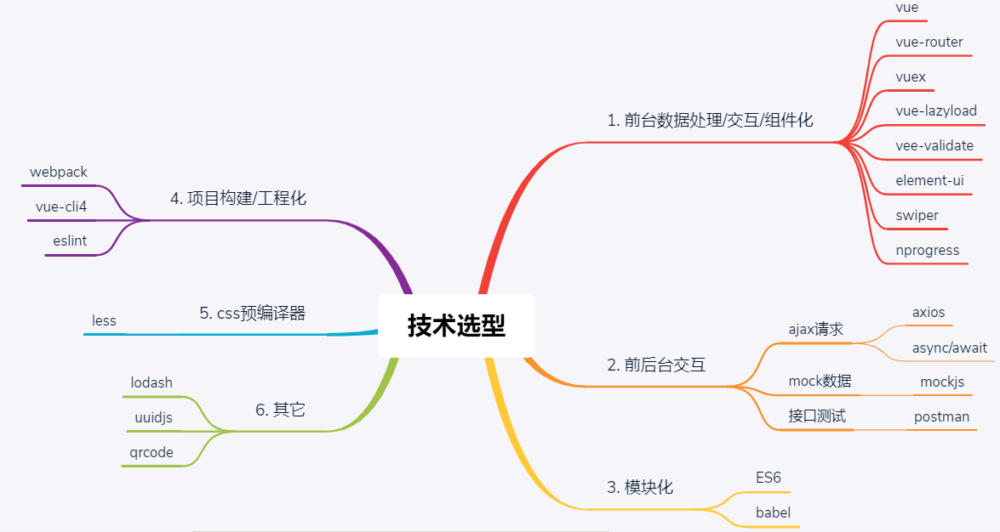

# 项目开发前准备

## 1. 项目描述

1. 此项目为在线电商Web App (SPA)

2. 包括首页, 搜索列表, 商品详情, 购物车, 地址管理, 下单&支付, 退款&退货, 用户注册&登陆等多个子模块

3. 使用Vue全家桶+ES6++Webpack+Axios等前端最新最热的技术

4. 采用模块化、组件化、工程化的模式开发

## 2.项目功能界面

  

说明: 完整功能界面运行最终版项目

## 3.技术选型

 

## 4.前端路由

 

## 5. API/接口

 

## 6.你能从此项目中学到什么?

### 6.1.流程及开发方法

1. 熟悉一个项目的开发流程

2. 学会模块化、组件化、工程化的开发模式

3. 掌握使用vue-cli脚手架初始化Vue.js项目

4. 学会模拟json后端数据，实现前后端分离开发

5. 学会ES6+eslint的开发方式

6. 掌握一些项目优化技巧

### 6.2. Vue插件或第三方库

1. 学会使用vue-router开发单页应用

2. 学会使用axios与后端进行数据交互

3. 学会使用vuex管理应用组件状态

4. 学会使用swiper&vue-awesome-swiper实现页面滑动效果

5. 学会使用elment-ui组件库构建界面

6. 学会使用vee-validate进行前台表单校验

7. 学会使用vue-lazyload实现图片惰加载

8. 学会使用mockjs模拟后台数据接口

9. 使用一些小的工具库

	(1).  lodash: 函数节流

	(2). nprogress: 请求进度

	(3). uuid: 生成唯一用户临时ID

	(4). qrcode: 生成支付二维码