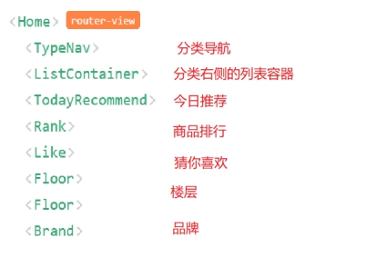

# 10. Home路由组件

## 10.1. Home静态组件
- 抽取出完整的Home静态路由组件

## 10.2. 从Home组件中抽取子组件(静态)

1. TypeNav: 3级分类导航
2. ListContainer: 包含轮播列表的容器
3. TodayRecommend: 今日推荐
4. Rank: 排行
5. Like: 猜你喜欢
6. Floor: 楼层
7. Brand: 品牌

 