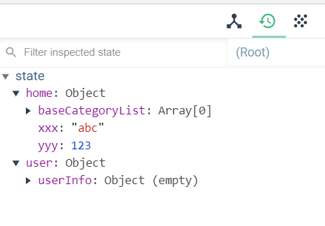

# 13. 使用vuex管理状态

## 13.1. 下载依赖包
```shell
npm install vuex
```


## 13.2. vuex的多模块编程

- vuex单模块问题: 
  - 需要的管理状态数据比较多, 那对应的mutations/actions模块就会变得比较
  - 如果添加新的数据管理, 需要修改现在文件(不断向其添加内容) 
- vuex多模块编程: 
  - 对各个功能模块的数据分别进行管理, 这样更加具有扩展性
- 什么时候需要用vuex多模块编程?  
  - 需要vuex管理的数据比较多时使用


## 13.3. store/modules/home.js

```js
/* 
vuex管理的home模块
*/
import {reqBaseCategoryList} from '@/api'

const state = {
  baseCategoryList: [], // 所有分类的数组
  xxx: 'abc',
  yyy: 123
}

const mutations = {
  /* 
  接收保存分类列表
  */
  RECEIVE_BASE_CATEGORY_LIST(state, list) {
    state.baseCategoryList = list
  }
}

const actions = {
  /* 
  异步获取商品三级分类列表
  */
  async getBaseCategoryList({ commit }) {
    const result = await reqBaseCategoryList();
    if (result.code === 200) {
      commit('RECEIVE_BASE_CATEGORY_LIST', result.data)
    }
  },
}

const getters = {

}

export default {
  state,
  actions,
  mutations,
  getters
}
```


## 13.5. store/modules/user.js

```js
/* 
vuex管理的用户模块
*/
export default {
  state: {
    userInfo: {}
  },
  actions: {},
  mutations: {},
  getters: {}
}
```


## 13.6. store/modules/index.js

```js
/* 
收集所有vuex管理的模块
*/
import home from './home'
import user from './user'

// 向外暴露包含所有vuex管理的模块的对象
export default {
  home,
  user
}
```


## 13.7. store/index.js

```js
/* 
Vuex最核心的管理对象store
*/
import Vue from 'vue'
import Vuex from 'vuex'
import modules from './modules'

// 声明使用vuex插件
Vue.use(Vuex)

// 向外暴露store对象
export default new Vuex.Store({
  modules, // 配置store的所有模块
})
```

## 13.8. 注册store
- main.js
```js
import store from './store'

new Vue({
  store, // 注册vuex的store对象  ==> 所有组件对象都有一个$store属性
})
```

 

## 13.9. 使用调试工具查看state数据

